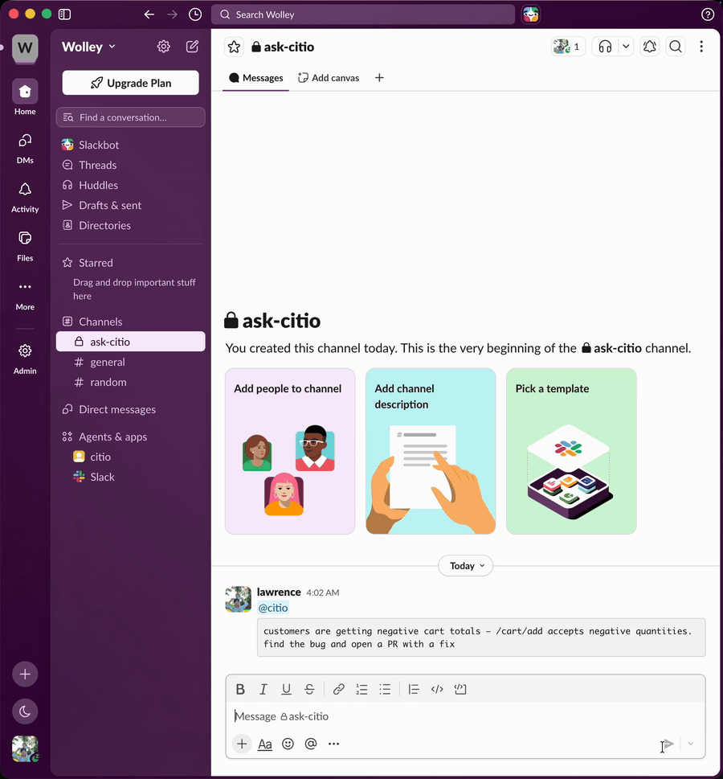
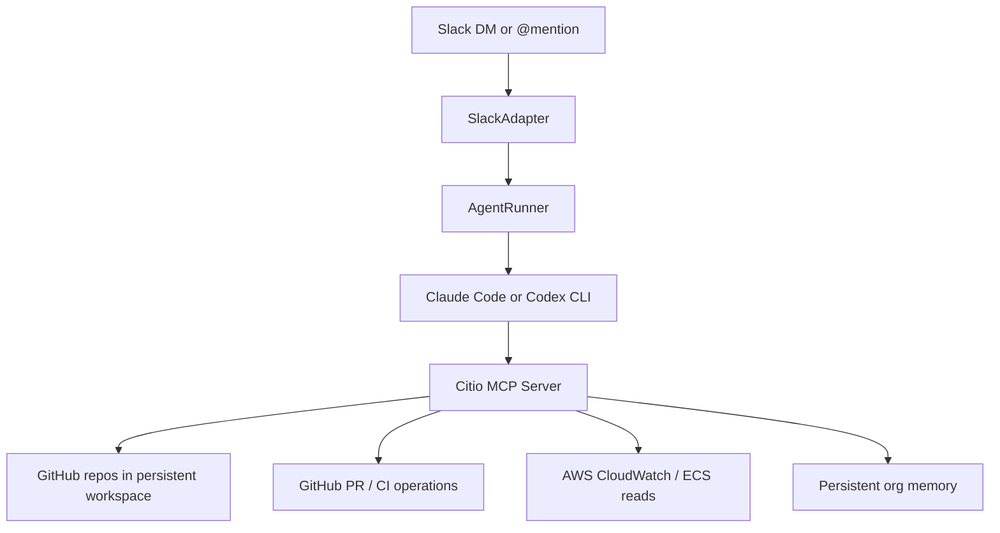
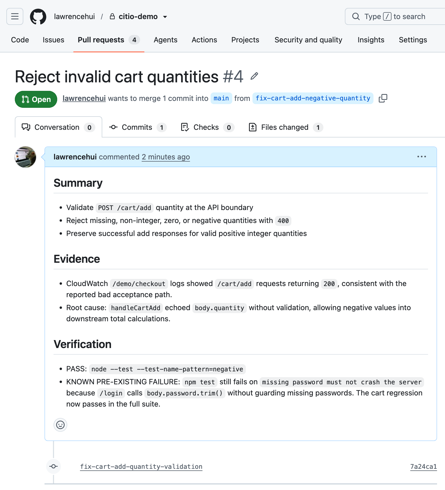
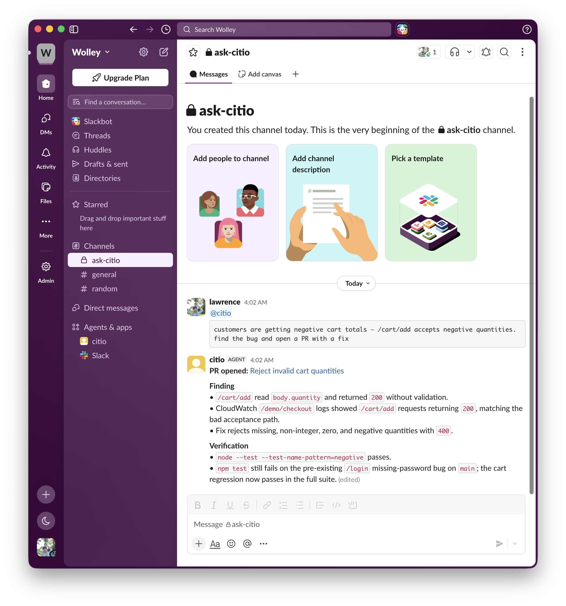
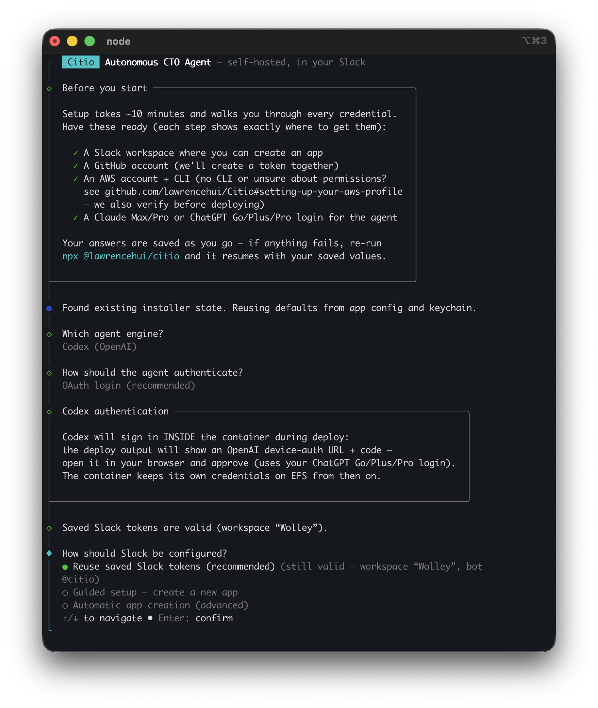

<div align="center">

# 🤖 Citio

**Your own AI engineering teammate — self-hosted, living in Slack.**

`@mention` it or DM it and ask for real engineering work — investigate a bug, dig through CloudWatch logs, fix code, open a PR — and Citio runs **Claude Code** or **OpenAI Codex** inside your own infrastructure to do it. Slack is the interface, a controlled MCP tool layer is the safety boundary, and every credential stays in your own infrastructure.

**No Team or Enterprise plan required.** Citio runs on an individual **Claude Max/Pro** or **ChatGPT Go/Plus/Pro (Codex)** subscription — the agent you already pay for, now working from Slack.

<br/>

[](#known-limitations)
[](LICENSE)
[](package.json)
[](https://www.typescriptlang.org/)
[](#-how-it-works)
[](#-quickstart)
[](CONTRIBUTING.md)

[](https://docs.anthropic.com/en/docs/claude-code)
[](https://openai.com/codex/)
[](#-citio-vs-hosted-slack-agents)

[**Quickstart**](#-quickstart) · [**How it works**](#-how-it-works) · [**Compare**](#-citio-vs-hosted-slack-agents) · [**Configuration**](#-configuration) · [**Customize**](#-customizing-your-instance) · [**Architecture**](docs/ARCHITECTURE.md) · [**Contributing**](CONTRIBUTING.md) · [**Security**](SECURITY.md)

<br/>

<!--  — uncomment when the asset lands -->

*A Slack message becomes an investigated, tested pull request — without leaving the thread.*

</div>

---

## ✨ Why Citio

Most teams can already chat with an LLM. The harder problem is letting a team ask for **real engineering work** from Slack without handing a raw shell and a pile of credentials directly to the model.

Citio closes that gap:

- 💬 **Slack is the user interface** — DM the bot or `@mention` it in a channel.
- 🧠 **Claude Code or Codex is the execution engine** — the provider CLI does the reasoning and planning.
- 🛡️ **Citio is the control plane** — it owns orchestration, session handling, repo setup, AWS/GitHub access, and a controlled MCP tool layer so the agent never touches raw credentials.
- 🏠 **Everything runs in your infra** — your container, your cloud account, your keys.

The result is something that can investigate bugs, inspect logs, edit code, and open pull requests — without a human sitting in the middle of every request.

> **Where it runs.** Citio is a self-hosted **container**. This first version ships a native **one-command AWS Fargate** deploy (on **Fargate Spot** by default — ~$5–11/month, or `citio pause` to $0 when idle). Running on other hosts — a **cheap VPS, Fly.io / Railway, or your own homelab** — and a **pay-per-use serverless** mode are on the [roadmap](#️-status--roadmap).

## 🆚 Citio vs. hosted Slack agents

Anthropic's [Claude Tag](https://techcrunch.com/2026/06/23/anthropics-claude-tag-is-learning-your-company-one-slack-message-at-a-time/) (June 2026) popularized exactly this idea — `@mention` an AI teammate in Slack and it does the work in-thread — but it's an Anthropic-hosted service gated to **Claude Team and Enterprise** plans, Claude-only. Citio takes the self-hosted, bring-your-own-subscription path:

|                    | **Citio**                                          | **Claude Tag**                       |
| ------------------ | -------------------------------------------------- | ------------------------------------ |
| **Hosting**        | Your AWS account, your infra                       | Anthropic-hosted SaaS                |
| **Plan required**  | Individual **Claude Max/Pro** *or* **ChatGPT Go/Plus/Pro** | **Claude Team or Enterprise**        |
| **Providers**      | Claude Code **or** OpenAI Codex                    | Claude only                          |
| **Credentials**    | Stay with you, behind an MCP allowlist             | Managed by the vendor                |
| **Best for**       | Solo devs & small teams who self-host              | Orgs already on Team/Enterprise      |

If you already pay for a Claude or ChatGPT subscription, Citio puts that same agent to work from Slack — no per-seat enterprise upgrade, no handing your code and credentials to someone else's cloud.

## 🧩 Features

- 🤝 **Bring your own agent** — Claude Code or OpenAI Codex, your subscription or API key.
- 🧰 **Controlled MCP tools** — `investigate_codebase`, `read_file`, `write_file`, `create_branch`, `create_pr`, `run_command` (allowlisted), `check_ci_status`, `query_logs`, `recall_context`, and more.
- 🔐 **Credential boundary** — the agent calls MCP tools; secrets live with Citio, not the model. Command execution is allowlisted and shell-metacharacter-rejected.
- 🧵 **Slack-native** — DMs and channel mentions, streamed progress, redacted output.
- 💾 **Persistent workspace & memory** — optional AWS EFS keeps repos, sessions, and provider auth across redeploys.
- 🪄 **One-command installer** — interactive setup wires up Slack, GitHub, provider auth, and deploys to ECS.

## 🏗️ How it works



Runtime shape:

1. A Slack request is normalized by the **Slack adapter**.
2. **AgentRunner** serializes work and manages provider sessions (one active task per container).
3. It spawns the **Claude Code / Codex CLI** as the agent, wired to Citio's **MCP server** via `--mcp-config`.
4. The agent uses MCP tools for codebase reads/writes, PR creation, log queries, and progress updates — never raw credentials.
5. Workspace, memory, and auth persist through **EFS** when enabled.

More detail: [docs/ARCHITECTURE.md](docs/ARCHITECTURE.md)

## 🚀 Quickstart

### Prerequisites

**On your machine** (the installer hard-checks for Docker, AWS CLI, and Git):

| Tool | Version / note |
| ---- | -------------- |
| **Node.js** | ≥ 22 |
| **Docker** | Running. The image is built `linux/amd64` — on Apple Silicon, Docker Desktop's buildx cross-builds it. |
| **AWS CLI** | v2, authenticated with a profile that has the permissions below — see [Setting up your AWS profile](#setting-up-your-aws-profile). |
| **Git** | Any recent version. |

> The agent CLIs (`claude`, `codex`), `gh`, and `jq` ship **inside the container image** — you don't install them on the host.

**Accounts & tokens**

- An **agent subscription**: Claude Max/Pro, or ChatGPT Go/Plus/Pro for Codex (API key works as a fallback).
- A **Slack app** (the installer can create it for you from a config token) + the target channel ID.
- A **GitHub fine-grained PAT** with `contents: write` + `pull_requests: write` on the repos you want worked on.

### Setting up your AWS profile

Citio deploys into **your own** AWS account. This takes about 10 minutes from "no AWS CLI" to "ready to install". If `aws sts get-caller-identity` already prints your account ID, skip to [Permissions](#permissions).

#### 1. Install the AWS CLI

| OS | Command |
|---|---|
| **macOS** | `brew install awscli` |
| **Ubuntu/Debian** | `sudo apt install awscli` (or the [official v2 installer](https://docs.aws.amazon.com/cli/latest/userguide/getting-started-install.html)) |
| **Windows** | [MSI installer](https://awscli.amazonaws.com/AWSCLIV2.msi) |

Verify with `aws --version` (v2.x recommended).

#### 2. Connect the CLI to your account

No AWS account yet? Create one at [aws.amazon.com](https://aws.amazon.com/free/). Then pick **one** route:

**Option A — IAM user + access key** (simplest for a personal account)

1. AWS Console → **IAM → Users → Create user** (e.g. `citio-admin`)
2. Attach permissions — see [Permissions](#permissions) below
3. Open the user → **Security credentials → Create access key** → choose *Command Line Interface (CLI)*
4. Configure the profile:

```bash
aws configure --profile citio
# AWS Access Key ID:      AKIA...
# AWS Secret Access Key:  ...
# Default region name:    eu-west-2      # any region you like
# Default output format:  json
```

**Option B — IAM Identity Center / SSO** (if your org uses it)

```bash
aws configure sso                  # follow the browser prompts
aws sso login --profile citio
```

**Verify either way** — this must print your account ID:

```bash
aws sts get-caller-identity --profile citio
```

The installer lists your profiles automatically and re-runs this check before it touches anything.

#### Permissions

The deploy creates an ECR repository, an ECS cluster/service/task definition, an IAM task role, a security group, CloudWatch log groups, a Secrets Manager secret, and (optionally) an EFS filesystem.

| Service | What Citio does with it |
| ------- | ----------------------- |
| **ECR** | Pushes the Citio container image to a private repo. |
| **ECS** | Creates the cluster, task definition, and Fargate service that runs the agent. |
| **EC2** | Creates one security group in your default VPC. |
| **IAM** | Creates the task role the container runs as (scoped to `role/citio*`). |
| **Secrets Manager** | Stores your Slack / GitHub / provider tokens in `citio/runtime` — never as plaintext task-definition env vars. |
| **CloudWatch Logs** | Container logs, plus the agent's `query_logs` tool. |
| **EFS** *(optional)* | Persists agent credentials and workspace across restarts. |

**Simplest (personal/sandbox account):** attach the AWS-managed **`AdministratorAccess`** policy to your IAM user and skip the JSON below.

**Least-privilege (shared or work account):** attach this policy instead — it is scoped to exactly what the installer calls, and nothing more.

<details>
<summary><b>Least-privilege IAM policy</b> (click to expand)</summary>

```json
{
  "Version": "2012-10-17",
  "Statement": [
    { "Sid": "STS",  "Effect": "Allow", "Action": ["sts:GetCallerIdentity"], "Resource": "*" },
    { "Sid": "ECR",  "Effect": "Allow", "Action": ["ecr:GetAuthorizationToken", "ecr:CreateRepository", "ecr:DescribeRepositories", "ecr:BatchCheckLayerAvailability", "ecr:InitiateLayerUpload", "ecr:UploadLayerPart", "ecr:CompleteLayerUpload", "ecr:PutImage", "ecr:BatchGetImage", "ecr:GetDownloadUrlForLayer"], "Resource": "*" },
    { "Sid": "ECS",  "Effect": "Allow", "Action": ["ecs:CreateCluster", "ecs:RegisterTaskDefinition", "ecs:CreateService", "ecs:UpdateService", "ecs:DescribeServices", "ecs:DescribeTasks", "ecs:ListTasks", "ecs:RunTask"], "Resource": "*" },
    { "Sid": "EFS",  "Effect": "Allow", "Action": ["elasticfilesystem:CreateFileSystem", "elasticfilesystem:DescribeFileSystems", "elasticfilesystem:CreateMountTarget", "elasticfilesystem:DescribeMountTargets"], "Resource": "*" },
    { "Sid": "EC2",  "Effect": "Allow", "Action": ["ec2:DescribeVpcs", "ec2:DescribeSubnets", "ec2:DescribeSecurityGroups", "ec2:CreateSecurityGroup", "ec2:AuthorizeSecurityGroupIngress"], "Resource": "*" },
    { "Sid": "Logs", "Effect": "Allow", "Action": ["logs:CreateLogGroup", "logs:DescribeLogGroups", "logs:GetLogEvents", "logs:FilterLogEvents", "logs:StartLiveTail"], "Resource": "*" },
    { "Sid": "Secrets", "Effect": "Allow", "Action": ["secretsmanager:CreateSecret", "secretsmanager:PutSecretValue", "secretsmanager:DescribeSecret", "secretsmanager:DeleteSecret"], "Resource": "arn:aws:secretsmanager:*:*:secret:citio/*" },
    { "Sid": "IAM",  "Effect": "Allow", "Action": ["iam:CreateRole", "iam:GetRole", "iam:PutRolePolicy", "iam:AttachRolePolicy", "iam:PassRole"], "Resource": "arn:aws:iam::*:role/citio*" }
  ]
}
```

</details>

> **The one people miss:** `iam:PassRole` scoped to `role/citio*`. Without it the ECS task can't assume the role the installer just created, and the deploy fails with `AccessDenied`.

#### Region

Use whichever region is closest to you. The installer auto-detects your CLI's default and offers it. All Citio resources land in **one** region — remember which, for teardown.

### Install and run

**Fastest — one command** (uses the published package, no clone, no build):

```bash
npx @lawrencehui/citio
```

Installed globally (`npm i -g @lawrencehui/citio`) the command is just `citio`, `citio status`, `citio destroy`.

**Or build from source** (to read/modify the code first, or to contribute):

```bash
git clone https://github.com/lawrencehui/Citio.git
cd Citio
npm ci
npm run build
npm run init
```

Both launch the **same** guided installer, which will:

- collect provider and auth settings (subscription OAuth first, API key as fallback)
- collect Slack and GitHub credentials (stored in your OS keychain when available)
- let you select which repos the agent can work on
- write a local `citio.yaml`
- build the image and deploy it to AWS ECS

## 💰 What it costs

Citio runs on **Fargate Spot by default — roughly 70% cheaper** than on-demand. Fargate bills per second, so cost tracks how long the task actually runs.

| Task size (`citio.yaml` → `deploy.aws`) | Spot (default) | On-demand | Good for |
|---|---|---|---|
| 0.5 vCPU / 1 GB (`task_cpu: 512, task_memory: 1024`) | **~$5/mo** | ~$18/mo | light/personal, small repos |
| **1 vCPU / 2 GB** *(default)* | **~$11/mo** | ~$36/mo | most use; bump memory if a big repo OOMs |
| 2 vCPU / 8 GB (`task_cpu: 2048, task_memory: 8192`) | ~$26/mo | ~$85/mo | large monorepos / heavy tasks |

Plus pennies for ECR storage and EFS (~$0.30/GB-mo). Not free-tier.

**You rarely pay the monthly figure.** Two ways to keep it near zero:

```bash
citio pause      # scale to 0 tasks — compute charges stop, deployment + EFS stay
citio resume     # back in ~1–2 min

citio destroy -- --yes --delete-efs    # remove everything
```

A one-hour demo session costs well under **$1**.

> **Spot note:** AWS can reclaim a Spot task (rare, 2-minute warning). Citio posts a "restarting, please re-send" notice and comes back automatically — fine for a single-instance bot. Want no interruptions? Set `deploy.aws.use_spot: false` in `citio.yaml` for on-demand.

### Teardown

```bash
citio destroy -- --yes --delete-efs
```

Or by hand, if you'd rather see every call:

```bash
aws ecs update-service --cluster citio --service citio --desired-count 0
aws ecs delete-service --cluster citio --service citio
aws ecs delete-cluster --cluster citio
aws ecr delete-repository --repository-name citio --force
aws secretsmanager delete-secret --secret-id citio/runtime --force-delete-without-recovery
# if you enabled EFS (find the ID first):
aws efs describe-file-systems --creation-token citio-memory --query 'FileSystems[0].FileSystemId'
aws efs delete-file-system --file-system-id <fs-...>   # delete mount targets first if prompted
```

## ⚙️ Configuration

The installer generates a local `citio.yaml`. The committed [`citio.example.yaml`](citio.example.yaml) shows the full shape:

```yaml
name: citio
engine:
  default_provider: claude        # or "codex"
  max_concurrent_sessions: 1
slack:
  bot_token: ${SLACK_BOT_TOKEN}
  app_token: ${SLACK_APP_TOKEN}
  channel_id: C0123456789
workspace:
  repos:
    - url: https://github.com/your-org/your-repo.git
      branch: main
  rules:
    - Always create PRs for code changes. Never push directly to main.
deploy:
  provider: aws
  aws:
    region: eu-west-2
    ecr_repo: citio                # AWS resource names are yours to choose
```

> ⚠️ `citio.yaml` holds local machine state (and is `.gitignore`d). Don't commit it.

**Runtime environment variables**

| Variable             | Purpose                                          |
| -------------------- | ------------------------------------------------ |
| `CITIO_CONFIG`       | Path to the config file (default `citio.yaml`)   |
| `CITIO_CONFIG_B64`   | Base64-encoded config (used by ECS, no file mount) |
| `CITIO_WORKSPACE`    | Workspace path (default `/workspace`)            |
| `CITIO_MEMORY`       | Memory/audit path (default `/memory`)            |

> 🔐 **Tokens are not stored as plaintext env vars.** Your Slack, GitHub, and provider tokens are written to an **AWS Secrets Manager** secret (`citio/runtime`) and injected into the container by ECS at start — so they are **not** readable via `ecs:DescribeTaskDefinition`. The values above are non-sensitive runtime config only.

## 🎛️ Customizing your instance

Yes — a Citio instance is configured almost entirely through `citio.yaml` (the installer writes it for you, and you can hand-edit then redeploy). The main knobs:

| Setting | Where | What it controls |
| ------- | ----- | ---------------- |
| **Provider** | `engine.default_provider` | `claude` or `codex` |
| **Agent rules** | `workspace.rules[]` | Plain-English guardrails injected into the agent ("always open PRs", "check logs before editing", your own policies) |
| **Repos** | `workspace.repos[]` | Which repos (and branches) the agent may clone and work on |
| **Who can use it** | `slack.authorized_users[]` / `admin_users[]` | Restrict channel `@mention`s and DMs to specific Slack user IDs (empty = everyone) |
| **Session limits** | `engine.max_session_duration_minutes`, `max_concurrent_sessions` | How long a task can run; how many run at once (1 = strictly serialized) |
| **Skills** | `skills.installed[]` | Optional community skill packs the agent can use |
| **Commit identity** | `workspace.git.user_name` / `user_email` | Author on commits the agent makes |
| **Bot name** | Slack app manifest (set at install) | The `@name` it answers to |
| **AWS sizing & names** | `deploy.aws.task_cpu`, `task_memory`, `ephemeral_storage_gb`, `ecr_repo`, `ecs_cluster`, `ecs_service`, `region` | Container resources and the names of the resources Citio provisions |

The fastest way to change behavior is usually `workspace.rules` — those instructions shape how the agent investigates, edits, and reports. After editing `citio.yaml`, re-run `npm run init` (or restart the container) to apply.

See [`citio.example.yaml`](citio.example.yaml) for the full annotated shape.

## 🧱 Supported today

| Area            | Support                                                        |
| --------------- | ------------------------------------------------------------- |
| **Providers**   | Claude Code, OpenAI Codex                                      |
| **Deploy**      | AWS ECS / Fargate, AWS ECR                                     |
| **Persistence** | Optional AWS EFS for workspace, memory, and provider auth      |

Citio is currently **AWS-first**. Multi-cloud support is not part of the current public release.

## 🧪 Development

```bash
npm run typecheck   # tsc --noEmit
npm run build       # compile to dist/
npm run test        # node:test suite
npm run dev         # run locally with tsx
```

## 📸 Screenshots

**The PR Citio opened** — real, reviewable work on GitHub:

<!--  — uncomment when the asset lands -->

**Working in a channel** — `@mention` it where your team already talks:

<!--  — uncomment when the asset lands -->

**The installer** — one guided command from zero to deployed:

<!--  — uncomment when the asset lands -->

## 🗺️ Status & roadmap

Citio is **pre-1.0**. This release deploys natively to **AWS Fargate** (Spot by default for low cost); the container itself is host-agnostic, so more deploy targets are coming.

- ✅ Slack-native control plane for Claude Code / Codex
- ✅ Controlled MCP tool layer with audit log
- ✅ One-command AWS Fargate installer (Fargate Spot default) with optional EFS persistence
- ✅ `citio pause` / `citio resume` / `citio destroy` for cost control
- ⏳ Not yet a hardened sandbox (provider CLIs retain native shell inside the container)
- ⏳ One active agent task per container
- ⏳ Native deploy target is **AWS Fargate** today — **on the roadmap:** run on any Docker host (VPS / Fly / Railway / homelab) and a pay-per-use serverless (Slack HTTP → Lambda → on-demand task) mode for ~$1–3/month

### Known limitations

Citio is not a fully hardened multi-cloud platform yet. Treat this release as **AWS-first and pre-1.0**. Read this before deploying anywhere sensitive.

**Security and isolation**
- Citio is a control plane, but the provider CLIs **still retain native shell capabilities inside the container**. The MCP tool layer is safer than handing an agent raw credentials — but it is **not a policy-grade sandbox**. Run it in an account you're willing to let an agent act in.
- The installer stores secrets in your OS keychain when available, with a file fallback where no keychain backend exists.

**Runtime and sessions**
- One active agent task runs at a time per container — intentional; the provider session is container-scoped.
- Provider sessions don't survive a container restart or redeploy. Citio retries a failed resume as a fresh session, but provider-side conversation state is ephemeral.
- Workspace state persists across redeploys **only** when EFS persistence is enabled.

**Providers**
- Claude and Codex are both supported, but not symmetric: Claude uses `CLAUDE_CODE_OAUTH_TOKEN` or an API key; Codex OAuth depends on a persisted `~/.codex/auth.json`.
- Codex still relies on the CLI's native execution model — its surface isn't as clean as Claude's `--mcp-config`.

**Installer and deployment**
- The interactive installer is meant for a **trusted operator machine**, not CI/CD runners.
- Local `citio.yaml` is local machine state — don't commit it.

## 🧯 Troubleshooting

| Symptom | Fix |
|---|---|
| `Unable to locate credentials` | Run `aws configure --profile citio` — see [Setting up your AWS profile](#setting-up-your-aws-profile). |
| `ExpiredToken` / SSO session expired | `aws sso login --profile citio` |
| `AccessDenied` on **`iam:PassRole`** | Your profile is missing the `IAM` statement. Attach the [least-privilege policy](#permissions) — this is the most common failure. |
| `AccessDenied` on **`secretsmanager:*`** | Same cause: add the `Secrets` statement. Citio stores tokens in `citio/runtime`, not in plaintext env vars. |
| Docker push fails: `no basic auth credentials` | The installer logs into ECR for you. By hand: `aws ecr get-login-password \| docker login --username AWS --password-stdin <account>.dkr.ecr.<region>.amazonaws.com` |
| Deploy succeeds but Slack is silent | Check the app has `assistant_thread_started` events subscribed — re-paste the manifest from `citio manifest`. |
| Costs higher than expected | You may be on on-demand. Confirm `deploy.aws.use_spot` isn't `false` in `citio.yaml`, and use `citio pause` when idle. |

## 🙌 Contributing

Contributions are welcome — see [CONTRIBUTING.md](CONTRIBUTING.md). Keep diffs small, prefer runtime-safe behavior over clever abstractions, and don't commit local machine state.

## 🛡️ Security

**How credentials are handled**

- Your Slack, GitHub, and provider tokens live in **AWS Secrets Manager** (`citio/runtime`) — never as plaintext task-definition environment variables, and never baked into the Docker image.
- The agent reaches your systems through the **MCP tool layer**, not by holding credentials itself. `run_command` is allowlisted and rejects shell metacharacters.
- Everything runs in **your** AWS account. No third party sees your code or tokens.

**What Citio is not**

It is **not a hardened sandbox**. The provider CLIs keep native shell access inside the container — see [Known limitations](#known-limitations). Deploy it into an account you're comfortable letting an agent act in.

**Reporting**

Found a vulnerability? Report it privately — see [SECURITY.md](SECURITY.md). Please don't open a public issue for credential handling, auth bypass, shell injection, or sandbox escape.

## 📄 License

[MIT](LICENSE)
