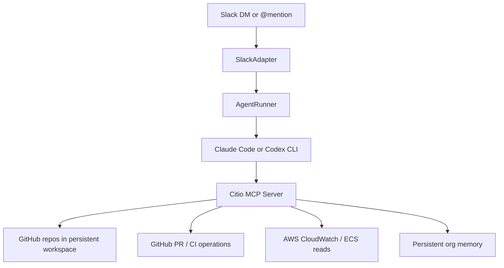

# Citio

Citio is a self-hosted Slack-native control plane for coding agents. It connects Slack requests to Claude Code or OpenAI Codex, exposes controlled MCP tools for repo/log/PR work, and runs as an AWS ECS service.

## Problem

Most teams can already chat with an LLM. The harder problem is letting a team ask for real engineering work from Slack without handing a raw shell and a pile of credentials directly to the model.

Citio exists for that gap:

- Slack is the user interface.
- Claude Code or Codex is the execution engine.
- Citio owns the orchestration layer, MCP tools, session handling, repo setup, and AWS/GitHub access.
- The result should be something that can investigate bugs, inspect logs, edit code, and open pull requests without requiring the CTO to sit in the middle of every request.

## What It Supports Today

### Providers

- Claude Code
- OpenAI Codex

### Deploy Target

- AWS ECS / Fargate
- AWS ECR
- Optional AWS EFS for persistent workspace, memory, and provider auth state

Citio is currently AWS-first. Multi-cloud support is not part of the current public release.

## Architecture



Runtime shape:

- Slack requests are normalized by the Slack adapter.
- AgentRunner serializes work and manages provider sessions.
- Claude/Codex connects to Citio MCP tools for codebase reads, writes, PR creation, log queries, and progress updates.
- Workspace, memory, and auth can persist through EFS when enabled.

More detail: [docs/ARCHITECTURE.md](docs/ARCHITECTURE.md)

## Quickstart

Prerequisites:

- Docker
- AWS CLI
- Git
- A Slack app with bot token and app token
- A GitHub PAT with repo contents + pull request permissions

Install dependencies and run the interactive installer:

```bash
npm ci
npm run build
citio
```

The installer will:

- collect provider and auth settings
- collect Slack and GitHub credentials
- let you select repos
- write a local `citio.yaml`
- deploy the image to ECS

## Screenshots

This repo is ready for screenshots in the README, but screenshot assets are not committed yet. Recommended launch assets:

- Slack DM flow
- Slack channel `@mention` flow
- Installer flow
- Opened PR created by Citio

Suggested paths:

- `docs/screenshots/slack-dm.png`
- `docs/screenshots/slack-channel.png`
- `docs/screenshots/installer.png`
- `docs/screenshots/pr.png`

## Status

Citio should be treated as pre-1.0.

- It is usable for AWS-first self-hosted experimentation.
- It is not yet a hardened sandbox.
- The current runtime model is one active agent task per container.

Known caveats: [docs/KNOWN_LIMITATIONS.md](docs/KNOWN_LIMITATIONS.md)

## Development

```bash
npm run typecheck
npm run build
npm run test
```

## Contributing

See [CONTRIBUTING.md](CONTRIBUTING.md).

## Security

See [SECURITY.md](SECURITY.md).

## License

ISC. See [LICENSE](LICENSE).
