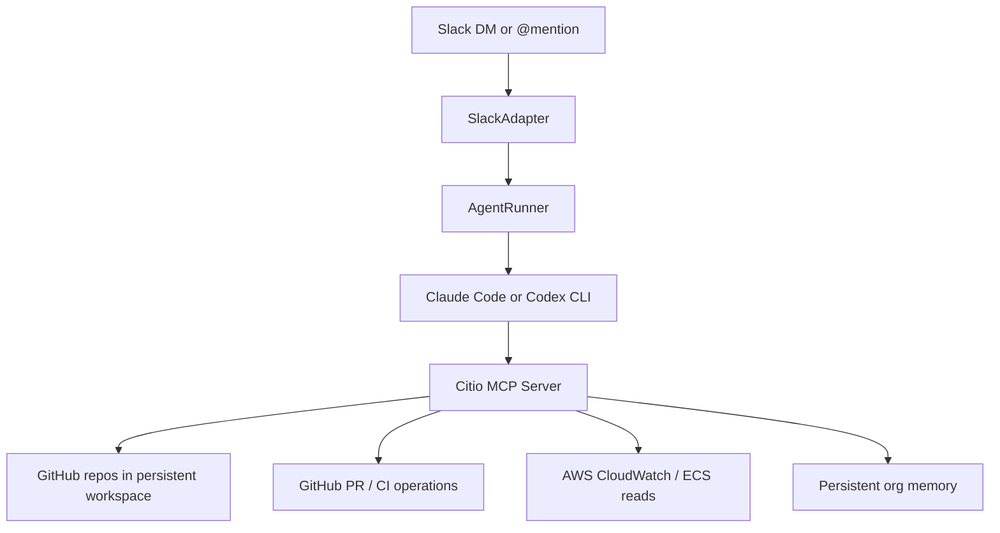

<div align="center">

# 🤖 Citio

**Your own AI engineering teammate — self-hosted, living in Slack.**

`@mention` it or DM it and ask for real engineering work — investigate a bug, dig through CloudWatch logs, fix code, open a PR — and Citio runs **Claude Code** or **OpenAI Codex** inside your own infrastructure to do it. Slack is the interface, a controlled MCP tool layer is the safety boundary, and every credential stays in your AWS account.

**No Team or Enterprise plan required.** Citio runs on an individual **Claude Max/Pro** or **ChatGPT Plus (Codex)** subscription — the agent you already pay for, now working from Slack.

<br/>

[](docs/KNOWN_LIMITATIONS.md)
[](LICENSE)
[](package.json)
[](https://www.typescriptlang.org/)
[](#-how-it-works)
[](#-quickstart)
[](CONTRIBUTING.md)

[](https://docs.anthropic.com/en/docs/claude-code)
[](https://openai.com/codex/)
[](#-citio-vs-hosted-slack-agents)

[**Quickstart**](#-quickstart) · [**How it works**](#-how-it-works) · [**Compare**](#-citio-vs-hosted-slack-agents) · [**Configuration**](#-configuration) · [**Architecture**](docs/ARCHITECTURE.md) · [**Contributing**](CONTRIBUTING.md) · [**Security**](SECURITY.md)

</div>

---

## ✨ Why Citio

Most teams can already chat with an LLM. The harder problem is letting a team ask for **real engineering work** from Slack without handing a raw shell and a pile of credentials directly to the model.

Citio closes that gap:

- 💬 **Slack is the user interface** — DM the bot or `@mention` it in a channel.
- 🧠 **Claude Code or Codex is the execution engine** — the provider CLI does the reasoning and planning.
- 🛡️ **Citio is the control plane** — it owns orchestration, session handling, repo setup, AWS/GitHub access, and a controlled MCP tool layer so the agent never touches raw credentials.
- 🏠 **Everything runs in your infra** — your container, your AWS account, your keys.

The result is something that can investigate bugs, inspect logs, edit code, and open pull requests — without a human sitting in the middle of every request.

## 🆚 Citio vs. hosted Slack agents

Anthropic's [Claude Tag](https://techcrunch.com/2026/06/23/anthropics-claude-tag-is-learning-your-company-one-slack-message-at-a-time/) (June 2026) popularized exactly this idea — `@mention` an AI teammate in Slack and it does the work in-thread — but it's an Anthropic-hosted service gated to **Claude Team and Enterprise** plans, Claude-only. Citio takes the self-hosted, bring-your-own-subscription path:

|                    | **Citio**                                          | **Claude Tag**                       |
| ------------------ | -------------------------------------------------- | ------------------------------------ |
| **Hosting**        | Your AWS account, your infra                       | Anthropic-hosted SaaS                |
| **Plan required**  | Individual **Claude Max/Pro** *or* **ChatGPT Plus** | **Claude Team or Enterprise**        |
| **Providers**      | Claude Code **or** OpenAI Codex                    | Claude only                          |
| **Credentials**    | Stay with you, behind an MCP allowlist             | Managed by the vendor                |
| **Best for**       | Solo devs & small teams who self-host              | Orgs already on Team/Enterprise      |

If you already pay for a Claude or ChatGPT subscription, Citio puts that same agent to work from Slack — no per-seat enterprise upgrade, no handing your code and credentials to someone else's cloud.

## 🧩 Features

- 🤝 **Bring your own agent** — Claude Code or OpenAI Codex, your subscription or API key.
- 🧰 **Controlled MCP tools** — `investigate_codebase`, `read_file`, `write_file`, `create_branch`, `create_pr`, `run_command` (allowlisted), `check_ci_status`, `query_logs`, `recall_context`, and more.
- 🔐 **Credential boundary** — the agent calls MCP tools; secrets live with Citio, not the model. Command execution is allowlisted and shell-metacharacter-rejected.
- 🧵 **Slack-native** — DMs and channel mentions, streamed progress, redacted output.
- 💾 **Persistent workspace & memory** — optional AWS EFS keeps repos, sessions, and provider auth across redeploys.
- 🪄 **One-command installer** — interactive setup wires up Slack, GitHub, provider auth, and deploys to ECS.

## 🏗️ How it works



Runtime shape:

1. A Slack request is normalized by the **Slack adapter**.
2. **AgentRunner** serializes work and manages provider sessions (one active task per container).
3. It spawns the **Claude Code / Codex CLI** as the agent, wired to Citio's **MCP server** via `--mcp-config`.
4. The agent uses MCP tools for codebase reads/writes, PR creation, log queries, and progress updates — never raw credentials.
5. Workspace, memory, and auth persist through **EFS** when enabled.

More detail: [docs/ARCHITECTURE.md](docs/ARCHITECTURE.md)

## 🚀 Quickstart

**Prerequisites**

- Docker
- AWS CLI (configured for your account)
- Git
- A Slack app with bot token and app token
- A GitHub PAT with repo `contents` + `pull_requests` permissions

**Install and run the interactive installer**

```bash
npm ci
npm run build
citio
```

The installer will:

- collect provider and auth settings (subscription OAuth first, API key as fallback)
- collect Slack and GitHub credentials (stored in your OS keychain when available)
- let you select which repos the agent can work on
- write a local `citio.yaml`
- build the image and deploy it to AWS ECS

## ⚙️ Configuration

The installer generates a local `citio.yaml`. The committed [`citio.example.yaml`](citio.example.yaml) shows the full shape:

```yaml
name: citio
engine:
  default_provider: claude        # or "codex"
  max_concurrent_sessions: 1
slack:
  bot_token: ${SLACK_BOT_TOKEN}
  app_token: ${SLACK_APP_TOKEN}
  channel_id: C0123456789
workspace:
  repos:
    - url: https://github.com/your-org/your-repo.git
      branch: main
  rules:
    - Always create PRs for code changes. Never push directly to main.
deploy:
  provider: aws
  aws:
    region: eu-west-2
    ecr_repo: citio                # AWS resource names are yours to choose
```

> ⚠️ `citio.yaml` holds local machine state (and is `.gitignore`d). Don't commit it.

**Runtime environment variables**

| Variable             | Purpose                                          |
| -------------------- | ------------------------------------------------ |
| `CITIO_CONFIG`       | Path to the config file (default `citio.yaml`)   |
| `CITIO_CONFIG_B64`   | Base64-encoded config (used by ECS, no file mount) |
| `CITIO_WORKSPACE`    | Workspace path (default `/workspace`)            |
| `CITIO_MEMORY`       | Memory/audit path (default `/memory`)            |

## 🧱 Supported today

| Area            | Support                                                        |
| --------------- | ------------------------------------------------------------- |
| **Providers**   | Claude Code, OpenAI Codex                                      |
| **Deploy**      | AWS ECS / Fargate, AWS ECR                                     |
| **Persistence** | Optional AWS EFS for workspace, memory, and provider auth      |

Citio is currently **AWS-first**. Multi-cloud support is not part of the current public release.

## 🧪 Development

```bash
npm run typecheck   # tsc --noEmit
npm run build       # compile to dist/
npm run test        # node:test suite
npm run dev         # run locally with tsx
```

## 📸 Screenshots

Screenshot assets aren't committed yet. Recommended launch assets:

- Slack DM flow → `docs/screenshots/slack-dm.png`
- Slack channel `@mention` flow → `docs/screenshots/slack-channel.png`
- Installer flow → `docs/screenshots/installer.png`
- A PR opened by Citio → `docs/screenshots/pr.png`

## 🗺️ Status & roadmap

Citio is **pre-1.0** — usable for AWS-first self-hosted experimentation.

- ✅ Slack-native control plane for Claude Code / Codex
- ✅ Controlled MCP tool layer with audit log
- ✅ One-command ECS installer with optional EFS persistence
- ⏳ Not yet a hardened sandbox (provider CLIs retain native shell inside the container)
- ⏳ One active agent task per container
- ⏳ Single-cloud (AWS) only

Full caveats: [docs/KNOWN_LIMITATIONS.md](docs/KNOWN_LIMITATIONS.md)

## 🙌 Contributing

Contributions are welcome — see [CONTRIBUTING.md](CONTRIBUTING.md). Keep diffs small, prefer runtime-safe behavior over clever abstractions, and don't commit local machine state.

## 🛡️ Security

Found a vulnerability? Please report it privately — see [SECURITY.md](SECURITY.md). Don't open a public issue for credential handling, auth bypass, shell injection, or sandbox escape.

## 📄 License

[MIT](LICENSE)
