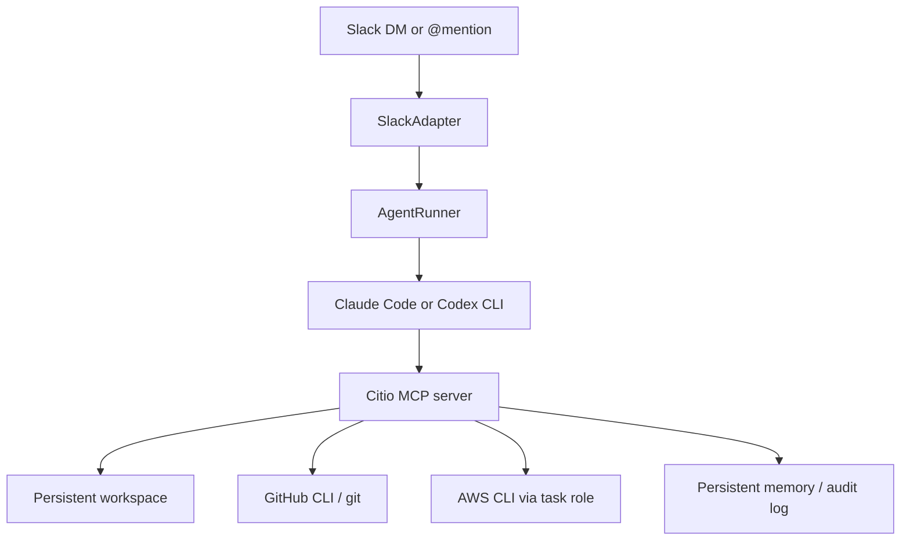

# Citio Architecture

Version: 0.1.3  
Status: Pre-1.0, AWS-first

## Overview

Citio is a self-hosted Slack-native control plane for coding agents.

It sits between Slack and a provider CLI such as Claude Code or OpenAI Codex. The provider is responsible for reasoning and planning. Citio is responsible for:

- Slack integration
- runtime/session orchestration
- MCP tool exposure
- workspace setup
- GitHub and AWS access flow
- installer and ECS deployment path

## High-Level Flow

## Main Components

### SlackAdapter

File: [src/adapters/slack.ts](../src/adapters/slack.ts)

Responsibilities:

- handle Slack Assistant DMs and channel `@mentions`
- normalize prompt construction
- stream progress back into Slack
- redact credentials from displayed output
- route each Slack interaction into AgentRunner

Current behavior:

- DMs and channel mentions now share the same provider-session lookup path
- progress output prefers normalized Citio MCP status instead of raw tool spam
- Slack surfaces one active provider conversation per running container

### AgentRunner

File: [src/core/agent-runner.ts](../src/core/agent-runner.ts)

Responsibilities:

- serialize execution
- spawn the selected provider CLI
- inject MCP configuration
- parse provider event streams
- handle session reuse and resume fallback
- enforce wall-clock timeouts

Current behavior:

- supports `claude` and `codex`
- one active task runs at a time per container
- if a resume fails, Citio retries once as a fresh session
- session continuity is container-scoped, not cross-redeploy provider continuity

### SessionManager

File: [src/core/session-manager.ts](../src/core/session-manager.ts)

Responsibilities:

- persist Slack thread to provider-session associations
- keep a shared provider session for the current runtime
- avoid reusing stale sessions from older container boots

Current behavior:

- session records persist to `sessions.json` in Citio memory
- records are scoped by runtime ID so redeploys do not try to resume dead sessions

### MCP Server

File: [src/core/mcp-entry.ts](../src/core/mcp-entry.ts)

Citio is primarily an MCP server. The provider CLI acts as the MCP client.

Current MCP tools include:

- `investigate_codebase`
- `read_file`
- `write_file`
- `create_branch`
- `create_pr`
- `run_command`
- `check_ci_status`
- `save_finding`
- `recall_context`
- `query_logs`
- `post_update`
- `query_audit_log`

These tools are the main control-plane interface for repo work, PR creation, log inspection, memory, and progress updates.

### WorkspaceManager

File: [src/core/workspace.ts](../src/core/workspace.ts)

Responsibilities:

- clone configured repos
- pull existing repos on boot
- generate top-level `CLAUDE.md` and `AGENTS.md`
- write workspace instructions for providers

When EFS persistence is enabled, the workspace is now stored under `/home/citio/workspace` so repo state survives redeploys.

## Persistence Model

Citio uses three kinds of persistence:

### 1. Provider auth

- Claude: `CLAUDE_CODE_OAUTH_TOKEN` or API key
- Codex: persisted `~/.codex/auth.json`

### 2. Workspace

- default ephemeral path: `/workspace`
- persistent installer path with EFS enabled: `/home/citio/workspace`

### 3. Memory

- default ephemeral path: `/memory`
- persistent installer path with EFS enabled: `/home/citio/memory`

Memory stores:

- `sessions.json`
- progress update files
- audit logs
- saved findings

## AWS Deployment Model

Installer file: [src/cli/init.ts](../src/cli/init.ts)

Current supported deployment target:

- AWS ECS Fargate
- image stored in ECR
- optional EFS for workspace, memory, and auth persistence

Current ECS sizing defaults:

- 2 vCPU
- 8 GB RAM
- 100 GiB ephemeral storage

Current AWS access model:

- Citio relies on the ECS task role for CloudWatch and ECS read access
- provider subprocesses inherit the task-role environment needed for those reads

## Installer State Model

Installer state files:

- non-secret config stored in app state
- secrets stored in OS keychain when available, with a file fallback
- local generated `citio.yaml` kept for deploy convenience
- committed repo template lives in [citio.example.yaml](../citio.example.yaml)

## Current Limits

Citio is not yet:

- a hardened sandbox
- multi-cloud
- multi-agent per container
- a fully provider-agnostic MCP runtime with identical behavior across CLIs

For current operational caveats, see [docs/KNOWN_LIMITATIONS.md](KNOWN_LIMITATIONS.md).
